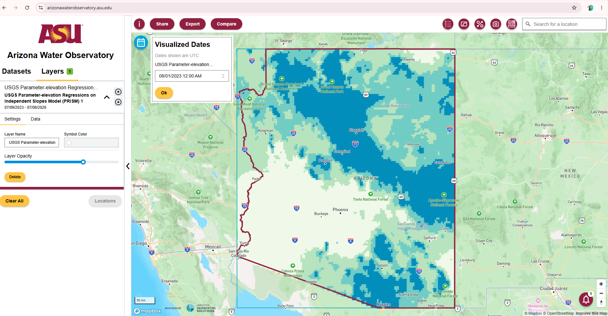
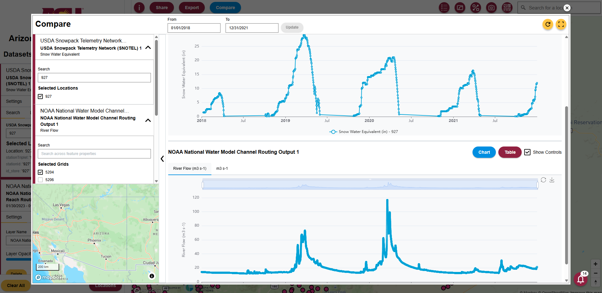
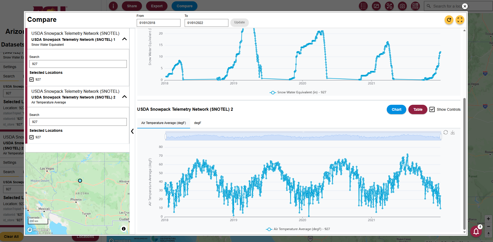

```{=html}
<style>
figcaption,
caption {
  text-align: center;
}
</style>
```

## Introduction

**Tutorial Overview**

In this tutorial, we demonstrate how the [Arizona Water Observatory (AWO)](https://arizonawaterobservatory.asu.edu/) can be used to follow the movement of water through a watershed in Arizona. We begin with snowpack observations from a SNOTEL station in the San Francisco Peaks, then identify the watershed that receives the snowmelt. Next, we retrieve watershed-averaged soil moisture data from [NASAʼs Soil Moisture Active Passive (SMAP) mission](https://smap.jpl.nasa.gov/) and streamflow at the watershed outlet, where it flows into the Little Colorado River, using data from the National Water Model. Together, these datasets illustrate how water moves through the landscape from mountain snowpack to downstream streamflow.

**Study Area and Context**

Although much of Arizona is arid, a large share of the stateʼs surface water originates as snow in its mountains. Each winter, mountain ranges such as the San Francisco Peaks and the White Mountains store snow as a natural reservoir. As temperatures rise in spring, this snow melts gradually, replenishing soil moisture, sustaining rivers, filling reservoirs, and ultimately supplying water for communities, agriculture, and ecosystems across the state. Examining snowpack, soil moisture, and streamflow together provides a more complete picture of how water moves through a watershed and supports water resources management and planning.

**About the Arizona Water Observatory**

The [Arizona Water Observatory (AWO)](https://arizonawaterobservatory.asu.edu/), developed by [Arizona State University’s Arizona Water Innovation Initiative](https://azwaterinnovation.asu.edu/) and the [Center for Geospatial Solutions](https://cgsearth.org/), provides a single access point to environmental water data from authoritative sources across Arizona. Through a common interface based on the [Open Geospatial Consortium Application Programming Interface - Environmental Data Retrieval (OGC API EDR) standard](https://www.ogc.org/standards/ogcapi-edr/), users can retrieve datasets consistently by location, time period, and parameter, regardless of the original data provider. By bringing together datasets that are often managed by different agencies and distributed through separate systems, AWO reduces the technical effort required to discover, access, and combine environmental water data for researchers, water managers, and other users.

Beyond the analysis in this tutorial, the Arizona Water Observatory provides access to many additional datasets, tools, and capabilities for exploring Arizona's water resources. Visit [AWO](https://arizonawaterobservatory.asu.edu/) to start exploring.

{#fig-awo-dashboard width="100%" fig-align="center"}

## Getting Started

This exercise uses **R** as the programming language and several packages that help retrieve environmental data and perform geospatial analysis:

-   [edr4r](https://cran.r-project.org/web/packages/edr4r/index.html) retrieves environmental data from an OGC API EDR.

-   [dplyr](https://cran.r-project.org/web/packages/dplyr/index.html) processes and prepares the data.

-   [sf](https://cran.r-project.org/web/packages/sf/index.html) performs spatial operations.

-   [ggplot2](https://cran.r-project.org/web/packages/ggplot2/index.html) creates plots for visualization and exploration.

-   [leaflet](https://cran.r-project.org/web/packages/leaflet/index.html) produces interactive maps.

If you do not have these packages installed, you can install them using `install.packages()`. Once the packages are installed, load them using `library()`

```{r}
#| warning: false
#| message: false
# install.packages(c("edr4r", "dplyr", "ggplot2", "sf", "leaflet"))
invisible(lapply(c("edr4r", "dplyr", "ggplot2", "sf", "leaflet"), library, character.only = TRUE))
```

## Step 1: Retrieving SNOTEL Data

To begin, we retrieve data from a [SNOTEL (Snow Telemetry)](https://wcc.sc.egov.usda.gov/nwcc/yearcount?network=sntl&state=&counttype=statelist) station. SNOTEL is a network of automated monitoring stations operated by the U.S. Department of Agriculture (USDA) Natural Resources Conservation Service (NRCS) that measures snowpack, precipitation, temperature, and other meteorological variables across the western United States.

We use [SNOTEL Station 927 (Snowslide Canyon)](https://wcc.sc.egov.usda.gov/nwcc/site?sitenum=927), located in the San Francisco Peaks near Flagstaff, Arizona. This station monitors Snow Water Equivalent (SWE or WTEQ), which represents the amount of water stored in the snowpack and is a key indicator of potential water availability.

In R, we use **`edr4r`** to interact with OGC API EDR services. **`edr4r`** allows users to connect to an API endpoint, specify a collection, define query parameters, and retrieve environmental data.

To begin, we create a client by providing the base URL of the [Arizona Water Observatory OGC API – EDR service](https://asu-awo-pygeoapi-864861257574.us-south1.run.app). Next, we select the [SNOTEL collection](https://asu-awo-pygeoapi-864861257574.us-south1.run.app/collections/snotel-edr). Finally, we define the station ID, parameter, time period, and output format for our query, as shown in the code below. The query returns the requested observations as an R tibble. The first few rows of the tibble are shown below.

```{r}

base_url <- "https://asu-awo-pygeoapi-864861257574.us-south1.run.app"
client <- edr_client(base_url)

station_id <- 927
start_date <- "2018-01-01"
end_date <- "2021-12-31"
datetime_range <- paste(start_date, end_date, sep = "/")

snotel <- edr_location(
  client,
  collection_id = "snotel-edr",
  location_id = station_id,
  datetime = datetime_range,
  parameter_name = "WTEQ",
  format = "covjson"
)

snotel_df <- transmute(
  covjson_to_tibble(snotel),
  date = as.Date(datetime),
  lon = x,
  lat = y,
  WTEQ = value
)

head(snotel_df)
```

## Step 2: Identifying the watershed and river network for snowmelt routing

To understand how snowmelt contributes to river flow, we first identify the watershed in which the SNOTEL station is located and the river network that conveys snowmelt downstream.

To do this, we use Hydrologic Unit Code 8 (HUC8) watersheds. [Hydrologic Unit Codes (HUCs)](https://water.usgs.gov/themes/hydrologic-units/) are watershed boundaries developed by the U.S. Geological Survey (USGS) for identifying and mapping drainage basins across the United States. We also use the [Mainstem Rivers](https://www.sciencebase.gov/catalog/item/65cbc0b3d34ef4b119cb37e9) dataset, which delineates the major river channels and helps visualize the primary flow paths that transport snowmelt through the watershed down to the watershed outlet.

Both datasets can accessed through [GeoConnex](https://internetofwater.org/geoconnex/), an open geospatial platform that serves authoritative hydrologic reference datasets using OGC APIs. The HUC8 watershed boundaries are available from the [HU08 collection](https://reference.geoconnex.us/collections/hu08), and the main river network is available from the [Mainstems collection](https://reference.geoconnex.us/collections/mainstems).

After retrieving these datasets, we extract the HUC8 watershed containing the SNOTEL station along with its corresponding main river network, and display them together.

```{r}
#| warning: false
#| message: false
# Create a spatial point from the SNOTEL station coordinates
snotel_point <- st_as_sf(
  snotel_df[1, c("lon", "lat")],
  coords = c("lon", "lat"),
  crs = 4326
)

# Download all HUC8 watershed boundaries from GeoConnex
huc8_all <- st_read("https://reference.geoconnex.us/collections/hu08/items?f=json&limit=3000", quiet=TRUE)

# Identify the HUC8 watershed containing the SNOTEL station
station_huc8 <- huc8_all[
  st_contains(huc8_all, snotel_point, sparse = FALSE),
]

# Get the watershed bounding box to limit the river query
huc8_bbox <- st_bbox(station_huc8)

# Build the GeoConnex request for main rivers in the HUC8 bounding box
river_url <- paste0(
  "https://reference.geoconnex.us/collections/mainstems/items?f=json",
  "&bbox=", paste(huc8_bbox, collapse = ","),
  "&limit=1000"
)

# Download the main river network
rivers_all <- st_read(river_url, quiet = TRUE)

# Clip the rivers to the selected HUC8 watershed
rivers_in_huc <- st_intersection(
  st_make_valid(rivers_all),
  st_make_valid(station_huc8)
)

# Plot the SNOTEL station, HUC8 boundary, and main rivers
ggplot() +
  geom_sf(
    data = station_huc8,
    fill = "lightblue",
    color = "navy",
    alpha = 0.35
  ) +
  geom_sf(
    data = rivers_in_huc,
    color = "dodgerblue4",
    linewidth = 0.7
  ) +
  geom_sf(
    data = snotel_point,
    color = "red",
    size = 3
  ) +
  theme_minimal() +
  labs(
    title = paste("SNOTEL Station", station_id, "in", station_huc8$name),
    subtitle = paste0("HUC8: ", station_huc8$huc8)
  )
```

## Step 3: Retrieving National Water Model routing locations

The next step is to retrieve streamflow data at the watershed outlet. Through AWO, we can access outputs from the [National Water Model (NWM)](https://water.noaa.gov/about/nwm). The NWM is a continental-scale hydrologic model developed by the National Oceanic and Atmospheric Administration (NOAA) that simulates the movement of water across the landscape and through the river network of the United States.

In this step, we retrieve the locations from the [National Water Model Channel Routing Output collection](https://asu-awo-pygeoapi-864861257574.us-south1.run.app/collections/National_Water_Model_Channel_Routing_Output) within the HUC8 watershed using **`edr4r`**. Each location represents a river reach where the NWM computes streamflow. We then identify the river reach closest to the watershed outlet, which provides the best representation of the streamflow leaving the watershed and flowing into the Little Colorado River.

```{r}
# Download one short time period to identify the NWM point locations
nwm <- edr_cube(
  client,
  collection_id = "National_Water_Model_Channel_Routing_Output",
  bbox = as.numeric(huc8_bbox),
  datetime = "2021-01-01/2021-01-02",
  parameter_name = "streamflow",
  format = "covjson"
)

# Convert the NWM response into a table
nwm_long <- covjson_to_tibble(nwm)

# Keep one row for each NWM point and assign an ID
nwm_points <- nwm_long |>
  distinct(x, y) |>
  mutate(nwm_point_id = row_number())

# Convert the NWM point table into spatial points
nwm_points_sf <- st_as_sf(
  nwm_points,
  coords = c("x", "y"),
  crs = 4326
)

# Keep only the NWM points inside the selected HUC8 watershed
nwm_points_in_huc <- st_filter(
  nwm_points_sf,
  station_huc8
)
```

We can also create an interactive map using **`leaflet`** to visualize the HUC8 watershed, the main river network, the NWM routing locations, and the SNOTEL station. The interactive map allows users to zoom in and out, pan across the watershed, and identify which routing output location is closest to the watershed outlet.

```{r}
leaflet(width = "100%", height = 560) |>
  
  # Add a simple background map
  addProviderTiles(
    providers$CartoDB.Positron,
    group = "Background map"
  ) |>
  
  # Add the HUC8 watershed boundary
  addPolygons(
    data = st_transform(station_huc8, 4326),
    fillColor = "#9ecae1",
    fillOpacity = 0.35,
    color = "#084594",
    weight = 2,
    popup = paste0("HUC8: ", station_huc8$huc8, "<br>", station_huc8$name),
    group = "HUC8 watershed"
  ) |>
  
  # Add the main river network within the HUC8 watershed
  addPolylines(
    data = rivers_in_huc,
    color = "#006d9c",
    weight = 2,
    opacity = 0.9,
    group = "Rivers"
  ) |>
  
  # Add the National Water Model streamflow points
  addCircleMarkers(
    data = nwm_points_in_huc,
    radius = 5,
    fillColor = "black",
    fillOpacity = 0.9,
    color = "white",
    weight = 0.8,
    popup = ~paste0("NWM point ID: ", nwm_point_id),
    group = "NWM points"
  ) |>
  
  # Add the SNOTEL station location
  addCircleMarkers(
    data = snotel_point,
    radius = 7,
    fillColor = "#d7191c",
    fillOpacity = 1,
    color = "white",
    weight = 1,
    popup = paste("SNOTEL station", station_id),
    group = "SNOTEL station"
  ) |>
  
  # Add layer control
  addLayersControl(
    baseGroups = c("Background map"),
    overlayGroups = c(
      "HUC8 watershed",
      "Rivers",
      "NWM points",
      "SNOTEL station"
    ),
    options = layersControlOptions(collapsed = FALSE)
  ) |>
  
  # Zoom the map to the HUC8 watershed extent
  fitBounds(
    lng1 = as.numeric(huc8_bbox["xmin"]),
    lat1 = as.numeric(huc8_bbox["ymin"]),
    lng2 = as.numeric(huc8_bbox["xmax"]),
    lat2 = as.numeric(huc8_bbox["ymax"])
  )
```

## Step 4: Retrieving National Water Model streamflow

After inspecting the interactive map, we identify the NWM location closest to the watershed outlet and note its point ID. We then use **`edr4r`** to retrieve streamflow data from AWO. Since the NWM provides hourly streamflow, we aggregate the data to daily mean streamflow, so it can be directly compared with the daily SWE observations from the SNOTEL station. The output of the query is a R tibble.

```{r}
# Select the NWM point from the map
selected_nwm_point_id <- 746

# Get the selected point
chosen_nwm_point <- nwm_points_in_huc |>
  filter(nwm_point_id == selected_nwm_point_id)

# Get longitude and latitude from that point
chosen_coords <- st_coordinates(chosen_nwm_point)

nwm_lon <- chosen_coords[1, "X"]
nwm_lat <- chosen_coords[1, "Y"]

# Small box around the selected point
nwm_buffer <- 0.0001

# Download streamflow for that point
nwm_resp <- edr_cube(
  client,
  collection_id = "National_Water_Model_Channel_Routing_Output",
  bbox = c(
    nwm_lon - nwm_buffer,
    nwm_lat - nwm_buffer,
    nwm_lon + nwm_buffer,
    nwm_lat + nwm_buffer
  ),
  datetime = datetime_range,
  parameter_name = "streamflow",
  format = "covjson"
)

# Convert to daily streamflow
nwm_daily <- covjson_to_tibble(nwm_resp) |>
  mutate(date = as.Date(datetime)) |>
  group_by(date) |>
  summarise(
    streamflow = mean(value, na.rm = TRUE),
    .groups = "drop"
  )

# Display the first few daily basin-mean streamflow values
head(nwm_daily)
```

## Step 5: Retrieving SMAP Soil Moisture

Soil moisture is a key variable linking snowmelt from the mountains to streamflow at the outlet. As snow melts, part of the water infiltrates into the soil, increasing soil moisture before contributing to runoff and river flow. Monitoring soil moisture helps us understand how snowmelt is partitioned between water stored in the soil and water that eventually reaches the river.

This exercise relies on soil moisture data from [NASA's Soil Moisture Active Passive (SMAP)](https://smap.jpl.nasa.gov/) mission, available through AWO in the [SMAP_SPL4SMGP collection](https://asu-awo-pygeoapi-864861257574.us-south1.run.app/collections/SMAP_SPL4SMGP). This collection includes both surface soil moisture in the top 5 cm and root-zone soil moisture. For this analysis, root-zone soil moisture is retrieved for the entire HUC8 watershed using `edr4r`. The retrieved values are then averaged across all pixels within the HUC8 to produce a daily basin-mean soil moisture time series.

```{r}
# Retrieve SMAP root-zone soil moisture for the HUC8 watershed and time period
smap_resp <- edr_cube(
  client,
  collection_id = "SMAP_SPL4SMGP",
  bbox = as.numeric(huc8_bbox),
  datetime = datetime_range,
  parameter_name = "sm_rootzone",
  format = "covjson"
)

# Convert the CoverageJSON response into a tabular format
smap_long <- covjson_to_tibble(smap_resp)

# Compute the daily mean root-zone soil moisture across all SMAP pixels within the HUC8 watershed
smap_daily <- smap_long |>
  mutate(date = as.Date(datetime)) |>
  group_by(date) |>
  summarise(
    sm_rootzone = mean(value, na.rm = TRUE),
    .groups = "drop"
  )

# Display the first few daily basin-mean soil moisture values
head(smap_daily)
```

## Step 6: Comparing snowpack, soil moisture, and streamflow

Now that we have retrieved the three datasets, we can compare them in a single plot to examine the connections among snowpack, soil moisture, and streamflow. The plot helps illustrate several key hydrologic processes. During winter, precipitation is stored as snow, increasing snow water equivalent (SWE), while streamflow remains low. As temperatures rise in spring, the snowpack melts and meltwater moves through the watershed, first infiltrating the soil and increasing soil moisture before contributing to runoff. This seasonal progression is especially visible in 2019 and 2020.

The hydrologic response of the watershed to snow varies substantially from year to year. In 2019, the largest snowpack resulted in sustained high soil moisture and prolonged streamflow. In contrast, although 2020 had a smaller snowpack, it produced the highest streamflow peak, likely due to more rapid snowmelt, wetter antecedent soil conditions, and possibly precipitation events during the melt period. By comparison, 2018 and 2021 were relatively dry years, with smaller snowpacks that produced only limited increases in soil moisture and little corresponding streamflow response.

```{r}
snotel_plot<- snotel_df |>
  transmute(
    date = date,
    variable = "Snow water equivalent (inches)",
    value = WTEQ
  )

smap_plot <- smap_daily |>
  transmute(
    date = date,
    variable = "Root-zone soil moisture (m3/m3)",
    value = sm_rootzone
  )

nwm_plot <- nwm_daily |>
  transmute(
    date = date,
    variable = "Streamflow (m3/s)",
    value = streamflow
  )

comparison_plot <- bind_rows(
  snotel_plot,
  smap_plot,
  nwm_plot
) |>
  mutate(
    variable = factor(
      variable,
      levels = c(
        "Snow water equivalent (inches)",
        "Root-zone soil moisture (m3/m3)",
        "Streamflow (m3/s)"
      )
    )
  )

ggplot(comparison_plot, aes(date, value)) +
  geom_line(color = "steelblue", linewidth = 0.7) +
  facet_wrap(~variable, scales = "free_y", ncol = 1) +
 scale_x_date(
    date_breaks = "3 months",
    date_labels = "%b\n%Y"
  ) +
  theme_minimal() +
  labs(
    title = paste("Snow, Soil Moisture, and Streamflow for", station_huc8$name),
    subtitle = paste(start_date, "to", end_date),
    x = "Date",
    y = NULL
  )
```

## The Compare Tool

AWO offers many functionalities, including a **Compare tool** that allows users to visualize one or more datasets from the AWO collections. For instance, Figure 2 shows how AWO can be used to compare SWE and streamflow from January 2018 to January 2022 as done in this exercise.

{#fig-compare-tool width="100%" fig-align="center"}

You can use the Compare Tool to plot and compare other time series available in the AWO. For example, as shown in Figure 3, you can compare SWE and temperature at the same location and over the same time period. This allows you to explore relationships between variables, such as the influence of temperature on snowmelt.

{#fig-compare-tool width="100%" fig-align="center"}

More information about using the Compare tool is available in the [user guide](https://awo-ui.netlify.app/), which can also be opened from the information button in AWO.

## Next steps

In this tutorial, you used the [Arizona Water Observatory](https://arizonawaterobservatory.asu.edu/) to connect snowpack, soil moisture, and streamflow observations into a single watershed-scale analysis, illustrating how water moves from mountain snowpack to downstream rivers. The same workflow can be adapted to explore other watersheds and environmental datasets available through AWO. Explore the platform to discover additional datasets, tools, and capabilities for analyzing Arizona's water resources.
